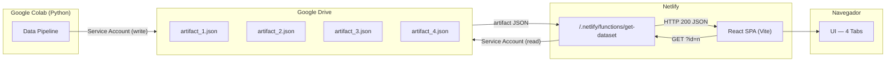
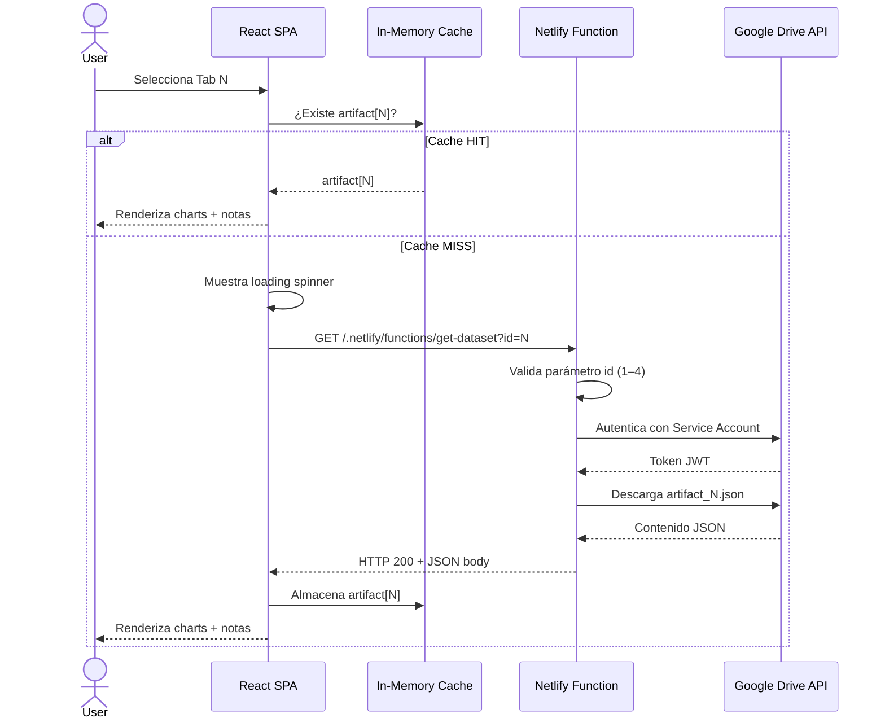
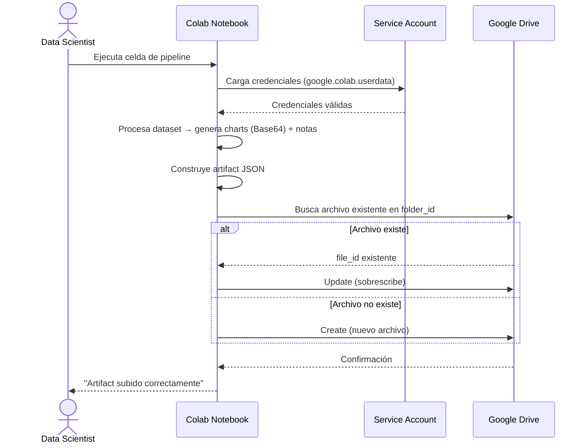

# Design Document — academic-data-viz

## Overview

`academic-data-viz` es una SPA académica de costo-cero que visualiza los resultados de análisis de 4 datasets. La arquitectura sigue un flujo de tres capas completamente desacopladas:

1. **Data Pipeline** (Google Colab / Python): procesa datasets, genera artefactos JSON con gráficos embebidos en Base64 y los sube a Google Drive usando una Service Account.
2. **API Serverless** (Netlify Functions / Node.js): actúa como proxy autenticado entre el navegador y Google Drive, protegiendo credenciales y resolviendo CORS.
3. **Frontend** (React + Vite): SPA con 4 pestañas que consume la Netlify Function, cachea los artefactos en memoria y renderiza gráficos y notas analíticas.



**Decisiones de diseño clave:**
- El pipeline usa `google-api-python-client` con autenticación por Service Account para evitar flujos OAuth interactivos en Colab.
- La Netlify Function parsea el JSON de la Service Account desde una variable de entorno (string), evitando archivos de credenciales en el repositorio.
- El frontend usa un `Map` en el estado de React (o `useRef`) como caché en memoria por sesión, evitando re-fetches al volver a una pestaña ya visitada.
- Los gráficos se embeben en Base64 dentro del JSON para eliminar dependencias de URLs externas y simplificar el despliegue.

---

## Architecture

### Diagrama de secuencia — carga de una pestaña



### Diagrama de secuencia — ejecución del pipeline



---

## Components and Interfaces

### 3.1 Data Pipeline (Python / Google Colab)

**Módulo:** `pipeline.ipynb` (notebook de Colab)

**Responsabilidades:**
- Autenticarse con Drive API usando Service Account.
- Procesar el dataset y generar gráficos (matplotlib/plotly) exportados como Base64.
- Construir el artefacto JSON.
- Subir o sobrescribir el artefacto en Google Drive.

**Interfaz de salida — Artifact JSON:**
```json
{
  "dataset_id": 1,
  "title": "Nombre del Dataset",
  "generated_at": "2024-01-15T10:30:00Z",
  "notes": "Texto de análisis en formato Markdown o HTML.",
  "charts": [
    {
      "id": "chart_1",
      "title": "Título del gráfico",
      "type": "image/png",
      "data": "<base64-encoded-image-string>"
    }
  ]
}
```

**Dependencias Python:**
- `google-api-python-client` — cliente oficial de Google APIs
- `google-auth` — autenticación con Service Account
- `matplotlib` / `plotly` — generación de gráficos
- `pandas` — procesamiento de datos

---

### 3.2 Netlify Function — `get-dataset`

**Archivo:** `netlify/functions/get-dataset.js`

**Interfaz HTTP:**

| Aspecto | Detalle |
|---|---|
| Método | `GET` |
| Ruta | `/.netlify/functions/get-dataset` |
| Query param | `id` — entero entre 1 y 4 |
| Respuesta OK | HTTP 200, `Content-Type: application/json`, body = Artifact JSON |
| Error validación | HTTP 400, `{ "error": "Invalid id parameter. Must be an integer between 1 and 4." }` |
| Error no encontrado | HTTP 404, `{ "error": "Artifact not found for dataset id N." }` |
| Error autenticación | HTTP 500, `{ "error": "Internal server error." }` (sin exponer credenciales) |

**Cabeceras CORS incluidas en todas las respuestas:**
```
Access-Control-Allow-Origin: *
Access-Control-Allow-Methods: GET, OPTIONS
Access-Control-Allow-Headers: Content-Type
```

**Variables de entorno requeridas:**

| Variable | Descripción |
|---|---|
| `GOOGLE_SERVICE_ACCOUNT_JSON` | JSON completo de la Service Account (string serializado) |
| `GOOGLE_DRIVE_FOLDER_ID` | ID de la carpeta de Google Drive que contiene los artefactos |

**Lógica interna:**
1. Manejar preflight `OPTIONS` → responder 200 con cabeceras CORS.
2. Validar `id` → si no es entero 1–4, retornar 400.
3. Parsear `GOOGLE_SERVICE_ACCOUNT_JSON` → construir cliente autenticado con `google-auth-library`.
4. Listar archivos en `GOOGLE_DRIVE_FOLDER_ID` con nombre `artifact_{id}.json`.
5. Si no existe → retornar 404.
6. Descargar contenido del archivo → retornar 200 con el JSON.

**Dependencias Node.js:**
- `googleapis` — cliente oficial de Google APIs para Node.js
- `google-auth-library` — autenticación JWT con Service Account

---

### 3.3 Frontend React (Vite)

**Estructura de archivos:**
```
src/
├── App.jsx                  # Componente raíz, gestiona tab activa y caché
├── components/
│   ├── TabBar.jsx           # Barra de navegación con 4 pestañas
│   ├── TabContent.jsx       # Contenedor de contenido de la tab activa
│   ├── ChartDisplay.jsx     # Renderiza lista de imágenes Base64
│   ├── NotesDisplay.jsx     # Renderiza notas analíticas
│   ├── LoadingSpinner.jsx   # Indicador de carga
│   └── ErrorMessage.jsx     # Mensaje de error
├── hooks/
│   └── useDataset.js        # Custom hook: fetch + caché en memoria
└── constants.js             # Nombres de datasets, IDs
```

**Interfaz del custom hook `useDataset`:**
```js
// Firma
const { data, loading, error } = useDataset(id, cache, setCache);

// Parámetros
// id: number (1–4)
// cache: Map<number, ArtifactJSON>  — estado compartido en App
// setCache: función para actualizar el Map

// Retorno
// data: ArtifactJSON | null
// loading: boolean
// error: string | null
```

**Flujo de estado en `App.jsx`:**
```js
const [activeTab, setActiveTab] = useState(1);
const [cache, setCache] = useState(new Map());  // caché en memoria por sesión
```

---

## Data Models

### 4.1 ArtifactJSON (contrato entre pipeline y frontend)

```typescript
interface Chart {
  id: string;           // Identificador único del gráfico, e.g. "chart_1"
  title: string;        // Título descriptivo del gráfico
  type: string;         // MIME type, e.g. "image/png" | "image/svg+xml"
  data: string;         // Imagen codificada en Base64 (sin prefijo data URI)
}

interface ArtifactJSON {
  dataset_id: number;   // 1 | 2 | 3 | 4
  title: string;        // Nombre del dataset
  generated_at: string; // ISO 8601 timestamp
  notes: string;        // Notas analíticas (texto plano o Markdown)
  charts: Chart[];      // Lista de gráficos (puede ser vacía)
}
```

### 4.2 Estado del Frontend

```typescript
// Estado global en App.jsx
interface AppState {
  activeTab: 1 | 2 | 3 | 4;
  cache: Map<number, ArtifactJSON>;  // Caché en memoria por sesión
}

// Estado por instancia de useDataset
interface DatasetHookState {
  data: ArtifactJSON | null;
  loading: boolean;
  error: string | null;
}
```

### 4.3 Respuestas de error de la Netlify Function

```typescript
interface ErrorResponse {
  error: string;  // Mensaje descriptivo, sin credenciales ni stack traces
}
```

### 4.4 Convención de nombres de archivos en Google Drive

Los artefactos se nombran con el patrón `artifact_{id}.json` donde `id` es el número del dataset (1–4). La Netlify Function busca archivos por nombre dentro del folder configurado.

| Dataset ID | Nombre de archivo |
|---|---|
| 1 | `artifact_1.json` |
| 2 | `artifact_2.json` |
| 3 | `artifact_3.json` |
| 4 | `artifact_4.json` |

---

## Correctness Properties

*Una propiedad es una característica o comportamiento que debe cumplirse en todas las ejecuciones válidas del sistema — esencialmente, una declaración formal sobre lo que el software debe hacer. Las propiedades sirven como puente entre las especificaciones legibles por humanos y las garantías de corrección verificables automáticamente.*

---

### Property 1: El artefacto generado contiene todos los campos requeridos

*Para cualquier* dataset válido procesado por el Data Pipeline, el artefacto JSON generado debe contener los campos `dataset_id`, `title`, `generated_at`, `notes` y `charts`, donde `charts` es una lista (posiblemente vacía).

**Validates: Requirements 1.2**

---

### Property 2: Los charts se exportan como Base64 válido

*Para cualquier* gráfico generado por el Data Pipeline, el campo `data` del chart en el artefacto JSON debe ser una cadena Base64 válida que se pueda decodificar a bytes de imagen sin error.

**Validates: Requirements 1.7**

---

### Property 3: La subida es idempotente — no genera duplicados

*Para cualquier* artefacto y cualquier estado previo de Google Drive (con o sin archivo existente para ese dataset), ejecutar el pipeline debe resultar en exactamente un archivo `artifact_{id}.json` en la carpeta configurada, nunca en dos o más archivos con el mismo nombre.

**Validates: Requirements 1.4**

---

### Property 4: La Netlify Function devuelve el artefacto correcto para cualquier id válido

*Para cualquier* valor de `id` entre 1 y 4, cuando el artefacto correspondiente existe en Google Drive, la Netlify Function debe responder con HTTP 200, `Content-Type: application/json`, y un body cuyo campo `dataset_id` sea igual al `id` solicitado.

**Validates: Requirements 2.3, 2.4**

---

### Property 5: Cualquier id inválido produce HTTP 400 con body JSON

*Para cualquier* valor de `id` que no sea un entero entre 1 y 4 (incluyendo strings, números fuera de rango, decimales, valores negativos, o ausencia del parámetro), la Netlify Function debe responder con HTTP 400 y un body JSON con el campo `error`.

**Validates: Requirements 2.6**

---

### Property 6: Las cabeceras CORS están presentes en todas las respuestas

*Para cualquier* request a la Netlify Function (válido o inválido, independientemente del código de respuesta), la respuesta debe incluir las cabeceras `Access-Control-Allow-Origin` y `Access-Control-Allow-Methods`.

**Validates: Requirements 2.5**

---

### Property 7: Solo la tab activa muestra su contenido

*Para cualquier* tab seleccionada (1–4), el área de contenido de esa tab debe ser visible y las áreas de contenido de las otras tres tabs deben estar ocultas.

**Validates: Requirements 3.2**

---

### Property 8: El fetch se realiza exactamente una vez por tab por sesión

*Para cualquier* secuencia de navegación entre tabs durante una misma sesión, el número de peticiones GET realizadas a la Netlify Function para un `id` dado debe ser exactamente 1, independientemente de cuántas veces se visite esa tab.

**Validates: Requirements 3.3, 3.7**

---

### Property 9: Cualquier error HTTP produce mensaje de error sin interrumpir la navegación

*Para cualquier* código HTTP de error devuelto por la Netlify Function (400, 404, 500, u otro código distinto de 200), el frontend debe mostrar un mensaje de error en el área de contenido de la tab activa, y las demás tabs deben seguir siendo seleccionables y funcionales.

**Validates: Requirements 3.6**

---

### Property 10: El renderizado de artefactos es completo y fiel

*Para cualquier* artefacto JSON válido recibido con N charts y notas no vacías, el frontend debe renderizar exactamente N elementos `` con atributo `src` que contenga los datos Base64 de cada chart, y el texto de las notas debe aparecer en el área de contenido de la tab activa.

**Validates: Requirements 3.5, 4.1, 4.2**

---

## Error Handling

### 6.1 Data Pipeline (Python)

| Escenario | Comportamiento |
|---|---|
| Fallo de autenticación con Drive API | Capturar excepción, imprimir mensaje descriptivo con causa, llamar a `sys.exit(1)` |
| Fallo de subida a Google Drive | Capturar excepción, imprimir código de error de Drive API, llamar a `sys.exit(1)` |
| Dataset vacío o malformado | Validar antes de procesar, imprimir mensaje descriptivo, detener ejecución |
| Error al generar gráfico | Capturar excepción de matplotlib/plotly, registrar el chart fallido, continuar con los demás o detener según configuración |

**Principio:** El pipeline falla rápido y de forma ruidosa. Cualquier error crítico detiene la ejecución con un mensaje claro. No se sube un artefacto parcial.

### 6.2 Netlify Function (Node.js)

| Escenario | HTTP Status | Body |
|---|---|---|
| `id` ausente o inválido | 400 | `{ "error": "Invalid id parameter. Must be an integer between 1 and 4." }` |
| `GOOGLE_SERVICE_ACCOUNT_JSON` malformado | 500 | `{ "error": "Internal server error." }` |
| Fallo de autenticación con Drive API | 500 | `{ "error": "Internal server error." }` |
| Archivo no encontrado en Drive | 404 | `{ "error": "Artifact not found for dataset id N." }` |
| Error de descarga de Drive | 500 | `{ "error": "Internal server error." }` |
| Preflight OPTIONS | 200 | (vacío, solo cabeceras CORS) |

**Principio:** Los errores internos (500) nunca exponen stack traces, credenciales ni detalles de infraestructura. Los errores de cliente (400, 404) incluyen mensajes descriptivos seguros.

### 6.3 Frontend (React)

| Escenario | Comportamiento |
|---|---|
| Respuesta HTTP != 200 | Mostrar `<ErrorMessage>` en el área de contenido de la tab activa |
| Error de red (fetch falla) | Mostrar `<ErrorMessage>` con mensaje genérico de conectividad |
| Artefacto sin charts | Mostrar mensaje informativo "No hay gráficos disponibles para este dataset" |
| Artefacto sin notas | Mostrar mensaje informativo "No hay notas disponibles para este dataset" |
| Error al decodificar imagen Base64 | Mostrar imagen rota con alt text descriptivo |

**Principio:** Los errores en una tab no afectan la navegación ni el estado de otras tabs. El usuario siempre puede continuar explorando.

---

## Testing Strategy

### 7.1 Evaluación de aplicabilidad de Property-Based Testing

Este feature contiene lógica de transformación de datos (pipeline Python), validación de parámetros (Netlify Function) y lógica de caché y renderizado (React). Estas capas son adecuadas para PBT porque:
- Las funciones de generación de artefactos tienen comportamiento que varía con el input.
- La validación de `id` aplica a un espacio de inputs amplio (cualquier string/número).
- La lógica de caché aplica a cualquier secuencia de navegación.
- Las funciones de renderizado aplican a cualquier artefacto JSON válido.

PBT **no** se aplica a: configuración de infraestructura, requisitos de seguridad de credenciales, diseño responsivo, ni documentación.

### 7.2 Librerías de Property-Based Testing

| Capa | Librería PBT |
|---|---|
| Python (Data Pipeline) | [Hypothesis](https://hypothesis.readthedocs.io/) |
| Node.js (Netlify Function) | [fast-check](https://fast-check.dev/) |
| React (Frontend) | [fast-check](https://fast-check.dev/) + [React Testing Library](https://testing-library.com/docs/react-testing-library/intro/) |

### 7.3 Tests de propiedades

Cada propiedad del diseño se implementa como un test de propiedad con mínimo **100 iteraciones**. Cada test debe incluir un comentario de trazabilidad:

```
// Feature: academic-data-viz, Property N: <texto de la propiedad>
```

| Propiedad | Capa | Librería | Descripción del generador |
|---|---|---|---|
| Property 1 | Python | Hypothesis | Generar datasets con distintos contenidos, tamaños y tipos de datos |
| Property 2 | Python | Hypothesis | Generar gráficos con distintos datos y verificar Base64 válido |
| Property 3 | Python | Hypothesis | Generar artefactos con/sin archivo previo en Drive (mock) |
| Property 4 | Node.js | fast-check | Generar ids válidos (1-4) con artefactos mock en Drive |
| Property 5 | Node.js | fast-check | Generar valores inválidos de id: strings, floats, negativos, >4, null |
| Property 6 | Node.js | fast-check | Generar requests válidos e inválidos y verificar cabeceras CORS |
| Property 7 | React | fast-check + RTL | Generar selecciones de tab (1-4) y verificar visibilidad |
| Property 8 | React | fast-check + RTL | Generar secuencias de navegación y contar llamadas a fetch (mock) |
| Property 9 | React | fast-check + RTL | Generar códigos HTTP de error y verificar mensaje + navegación |
| Property 10 | React | fast-check + RTL | Generar artefactos con N charts y notas aleatorias |

### 7.4 Tests unitarios (ejemplo-based)

Complementan los tests de propiedades con casos específicos:

**Data Pipeline:**
- Fallo de autenticación → excepción con mensaje descriptivo
- Fallo de upload → excepción con código de error de Drive API
- Dataset vacío → error antes de generar artefacto

**Netlify Function:**
- `id` ausente → HTTP 400
- Archivo no encontrado → HTTP 404
- Fallo de autenticación → HTTP 500 sin credenciales en body
- Preflight OPTIONS → HTTP 200 con cabeceras CORS

**Frontend:**
- TabBar renderiza exactamente 4 tabs con nombres correctos
- Spinner visible durante estado `loading=true`
- Artefacto sin charts → mensaje informativo
- Artefacto sin notas → mensaje informativo

### 7.5 Tests de integración

- Netlify Function con Drive API real (o emulada): verificar flujo completo de autenticación y descarga.
- Pipeline con Drive API real: verificar subida y sobrescritura de artefactos.

### 7.6 Smoke tests

- Verificar que `GOOGLE_SERVICE_ACCOUNT_JSON` y `GOOGLE_DRIVE_FOLDER_ID` están definidas en el entorno de Netlify.
- Verificar que no hay credenciales en el repositorio de código.
- Verificar que los elementos `` tienen `max-width: 100%`.
- Verificar renderizado en viewports de 320px y 1920px.
